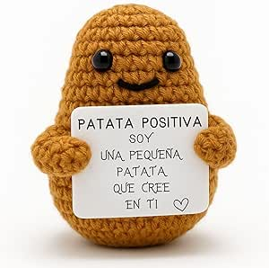

# Hola mundo cruel

 “El cronograma del projecte es mostra a la [@tbl:cronograma] i els resultats esperats a la [@fig:resultat].”


## Esto es otro nivel

{width=100}

## Cositas

Negreta (**text** o __text__)

Cursiva (*text* o _text_)

Ratllat (~~text~~)

Codi inline (`text`)

- [x] Fet
- [ ] Per fer

Este és un text amb nota al peu.[^1]

[^1]: Això és la nota al peu.

$$E=mc^2$$

$$ 
\frac{a^2 + b^2}{c^2} = 1
$$


```python
print("Hola món")

for i in range(3):
    print("Hola")


```

| Nom   | Edat | Nota |
|:------|:----:|-----:|
| Anna  |  17  |   9  |
| Manel |  16  |   7  |
| kk | 3 | 3 | 


: Cronograma de treball {#tbl:cronograma}

| Mes   | Tasca              | Estat   | Díes empleats |
|:------|:-------------------|:-------:|---:|
| Octubre | Revisió bibliogràfica | En procés | 3 |
| Novembre| Anàlisi de dades       | Pendent  | 0 |
| Desembre| Redacció preliminar    | Fet      | 13 |


{#fig:resultat}

> Això és una cita.


